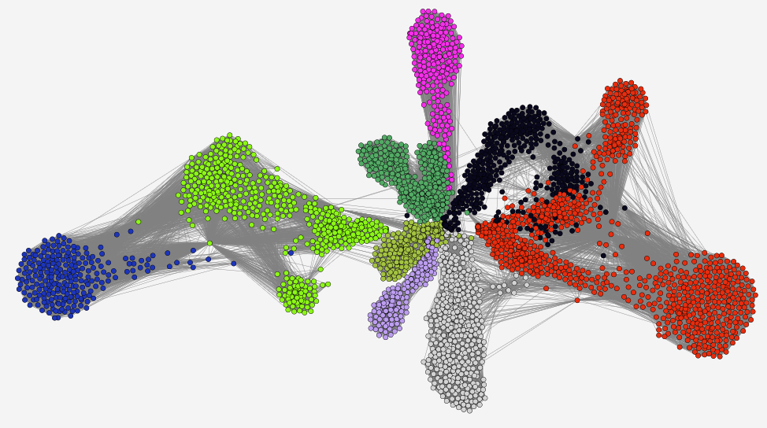

# Graph analyzer

Desktop network analyzing and visualization software



## Table of Contents
- [General features](#general-features)
- [Layout](#layout)
  * [ForceAtlas 2](#forceatlas-2)
  * [Random layout](#random-layout)
- [Community detection](#community-detection)
  * [Louvain method](#louvain-method)
- [Serialization formats](#serialization-formats)
  * [SQLite](#sqlite)
  * [Neo4j](#neo4j)
- [Roadmap](#roadmap)
- [Build and execution](#build-and-execution)
- [Troubleshooting](#troubleshooting)
- [Technologies](#technologies)
- [Acknowledgments](#acknowledgments)
- [Authors](#authors)
- [License](#license)

## General features

- Displays vertex and edge count
- Showing/hiding vertex labels
- Customizable edge color
- Configurable amount of rendered edges
- Manual vertex dragging (dragging vertex during layout makes its community follow it)

## Layout

### ForceAtlas 2
- Max UI updates per second — the tradeoff between layout speed and smoothness 
  (set a lower value for faster layout and a higher value for smoother video)
- Iterations per second — the number of algorithm iterations completed in the last second
- Tolerance — speed-accuracy tradeoff 
  (set a higher value to make vertices move faster and a lower value to make them oscillate less)
- Scaling — resulting layout size (a higher value results in a larger layout)
- Strong gravity — when turned on makes gravity force attract distant vertices more, resulting in a more compact layout
- Gravity — force preventing disconnected components from drifting away
- Prevent overlap — when turned on drastically repulses overlapping and nearly overlapping vertices 
  (slows down layout process, it's recommended to turn on this option when the layout is almost completed)
- Dissuade hubs — when turned on grants vertices with a high indegree a more central position
- Attraction types:
  * Linear — default attraction type
  * Logarithmic — makes clusters tighter but converges slower in some cases
- Edge weight exponent — influence of edge weights on a layout
- Multithreaded — when turned on, some computations are performed in parallel
- Barnes-Hut approximation — when turned on considerably improves performance by approximating repulsion force
- Barnes-Hut theta — acceptable repulsion approximation 
  (higher theta improves performance but results in unnatural vertex formations)

### Random layout
- Max coordinate deviation — resulting layout size

## Community detection

### Louvain method
- Pause between iterations — when turned on makes the algorithm pause after each iteration, letting the user examine intermediate results

## Serialization formats

### SQLite

Vertices are stored in the `Vertices` table with the following columns:
- `id` — unique textual identifier of the vertex
- `x` and `y` — vertex position
- `radius` — vertex radius
- `red`, `green`, and `blue` — vertex color

Edges are stored in the `Edges` table with the following columns:
- `from` — identifier of the edge head
- `to` — identifier of the edge weight
- `weight` — edge weight

### Neo4j

Vertices are represented as Neo4j nodes with the following properties:
- `id` — unique textual identifier of the vertex
- `x` and `y` — vertex position
- `radius` — vertex radius
- `red`, `green`, and `blue` — vertex color

Edges are represented as Neo4j relationships between corresponding nodes and have the following property:
- `weight` — edge weight

## Roadmap

* Add example graphs
* Support opening non-analyzed graphs
* Store colors for communities and not for individual vertices
* Support CSV serialization format
* Implement centrality algorithm
  
## Build and execution

To build or run this project, you must use JDK 8 with JavaFX (`jfxrt.jar`) package installed. 
See [Troubleshooting](#troubleshooting) for more details.

Build: `./gradlew assemble`  
Run: `./gradlew run`  
Run tests: `./gradlew test`  
Run tests in headless mode (without UI): `./gradlew test -Pheadless=true`

## Troubleshooting

```
👻 java.lang.NoClassDefFoundError: javafx/application/Application
```
```
👻 Supertypes of the following classes cannot be resolved. Please make sure you have the required dependencies in the classpath:
      class tornadofx.UIComponent, unresolved supertypes: javafx.event.EventTarget
      class tornadofx.App, unresolved supertypes: javafx.application.Application
      class org.controlsfx.control.ControlsFXControl, unresolved supertypes: javafx.scene.control.Control
      class tornadofx.FXTask, unresolved supertypes: javafx.concurrent.Task
      class tornadofx.Fieldset, unresolved supertypes: javafx.scene.layout.VBox
```
💡 You are using JDK distribution without JavaFX (`jfxrt.jar`) package.

✅ Install JDK distribution that includes JavaFX by default (e.g. [Oracle JDK 8](https://www.oracle.com/java/technologies/javase/javase-jdk8-downloads.html)), update `JAVA_HOME` system variable, and restart your computer.
## Technologies

**UI:** JavaFX, TornadoFX, ControlsFX

**Databases:** SQLite (via Exposed Framework), Neo4j

**Tests:** Junit5, Mockk, TestFX

## Acknowledgments

 - [ForceAtlas2, a Continuous Graph Layout Algorithm for Handy Network Visualization Designed for the Gephi Software](https://journals.plos.org/plosone/article?id=10.1371/journal.pone.0098679)
 - [Fast unfolding of communities in large networks](https://arxiv.org/abs/0803.0476)
 - [graphs-visualization-sandbox](https://github.com/skoret/graphs-visualization-sandbox)

## Authors

- [Ilya Muravjov](https://github.com/IlyaMuravjov) - layout, SQLite serializer, UI
- [Egor Denisov](https://github.com/Lev0nid) - community detection, Neo4j serializer 

  
## License

[MIT](LICENSE)
